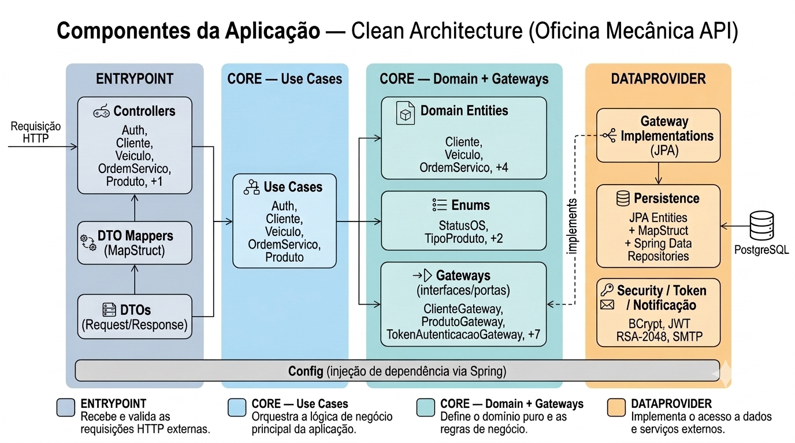
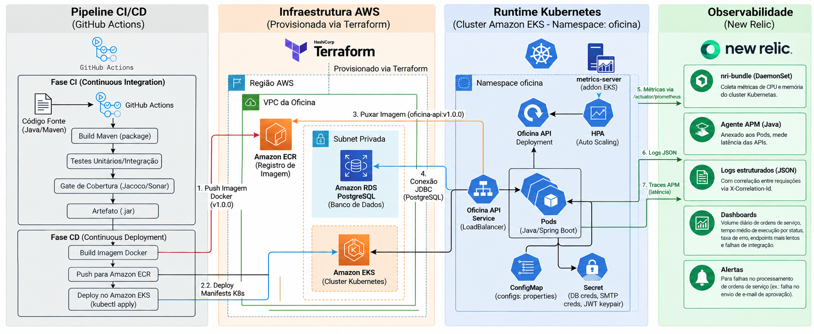

# Oficina Mecânica — Sistema Integrado de Atendimento

> Tech Challenge — FIAP SOAT Fase 3
> Spring Boot 3.2 · Java 21 · Clean Architecture · PostgreSQL / H2 · New Relic
>
> Um de quatro repositórios: a aplicação (este), `fiap-15soat-oficina-infra-k8s`,
> `fiap-15soat-oficina-infra-db` e `fiap-15soat-oficina-lambda-auth`.

---

## Sobre o Projeto

Sistema back-end para uma oficina mecânica de médio porte com gestão completa de ordens de serviço, clientes, veículos, peças, serviços e controle de estoque. O projeto foi construído seguindo **Clean Architecture** — regras de negócio isoladas em casos de uso (`core/usecase`), independentes de framework, banco e transporte HTTP.

Além do CRUD e do fluxo de OS, o sistema conta com **notificação por e-mail ao cliente**: ao avançar para `AGUARDANDO_APROVACAO`, a API envia automaticamente um e-mail HTML com dois botões — aprovar ou recusar o orçamento. Cada botão carrega um token JWT de uso único (assinado com o mesmo par de chaves RSA da autenticação); o cliente clica no link, o endpoint público `/aprovacao-os` valida o token, aplica a transição de status e devolve uma página de confirmação estilizada.

Todos os endpoints administrativos são protegidos por autenticação JWT (RSA-2048) com controle de acesso por role.

### Decisão de banco de dados

O projeto utiliza **dois perfis**:

| Perfil | Banco | Quando usar |
|--------|-------|-------------|
| `dev` (padrão local) | H2 in-memory | Desenvolvimento e testes — zero configuração, console web integrado |
| `default` (Docker/produção) | PostgreSQL 16 | Ambiente containerizado via `docker-compose` |

A troca é transparente: basta definir `SPRING_PROFILES_ACTIVE` na variável de ambiente. O Hibernate gera o DDL automaticamente em ambos os casos.

---

## Arquitetura

O projeto segue **Clean Architecture**: dependências sempre apontam para dentro — `entrypoint` e `dataprovider` dependem de `core`; `core` não conhece nenhum dos dois.

### Diagrama de componentes



| Camada | Componentes | Papel |
|---|---|---|
| **Entrypoint** | Controllers, DTO Mappers, DTOs | Recebe a requisição HTTP |
| **Use Cases** | `AuthUseCase`, `ClienteUseCase`, `VeiculoUseCase`, `OrdemServicoUseCase`, `ProdutoUseCase` | Orquestra as regras de aplicação, chama gateways por interface |
| **Domain + Gateways** | Entidades de domínio, enums, exceções, interfaces de gateway | Regras da empresa — camada mais protegida, zero dependência de framework |
| **Dataprovider** | Implementações JPA, security, token, notificação | Fala com o mundo externo (banco, e-mail, criptografia) |
| **Config** | `SecurityConfig`, `UseCaseConfig`, `CorsConfig`, `SwaggerConfig`, `DataLoader`, `GlobalExceptionHandler` | Fiação do Spring (injeção de dependência) — atravessa as camadas, fora do fluxo de chamada |

> **Regra de dependência:** as setas sólidas seguem sempre o fluxo Entrypoint → Use Cases → Domain/Gateways. Nada em `core.domain` conhece Spring, JPA ou HTTP. A seta tracejada `implements` mostra a inversão: é o Dataprovider que aponta para a interface definida no Core — nunca o contrário.

### Infraestrutura e fluxo de deploy



Pipeline CI/CD (GitHub Actions) builda e testa a aplicação, publica a imagem no Amazon ECR e aplica os manifestos Kubernetes no cluster EKS. A infraestrutura é provisionada via Terraform em repositórios separados — VPC/EKS/ECR em `fiap-15soat-oficina-infra-k8s` e o RDS em `fiap-15soat-oficina-infra-db`; os manifestos de runtime (Deployment, Service, HPA, ConfigMap, Secret) ficam em `/k8s`. Detalhes de cada etapa nas seções **Deploy em Kubernetes**, **Provisionamento da infraestrutura** e **CI/CD** mais abaixo.

### Estrutura de pacotes

```
br.com.fiap.oficina
├── core/
│   ├── domain/
│   │   ├── entity/      # Entidades de domínio (sem anotações JPA)
│   │   ├── enums/       # StatusOS, TipoProduto, TipoDocumento, TipoMovimentacao
│   │   └── exception/   # Exceções de domínio (RecursoNaoEncontrado, RegraDeNegocio…)
│   ├── gateway/         # Interfaces (portas de saída) — ClienteGateway, EstoqueGateway…
│   └── usecase/         # Casos de uso — única camada com regras de negócio
├── dataprovider/        # Adaptadores de saída
│   ├── gateway/         # Implementações JPA dos gateways
│   ├── notificacao/     # SMTP (produção) e Log (dev/test) de e-mail
│   ├── persistence/     # Entidades JPA, repositórios Spring Data, mappers MapStruct
│   ├── security/        # BCrypt (CriptografiaSenhaGatewayImpl)
│   └── token/           # JWT de aprovação (AprovacaoTokenGatewayImpl) e autenticação
├── entrypoint/
│   └── controller/      # Controllers REST + mappers MapStruct DTO ↔ domínio
├── config/              # SecurityConfig, SwaggerConfig, UseCaseConfig, DataLoader
├── dto/
│   ├── request/         # Records de entrada com validação (@Valid)
│   └── response/        # Records de saída
└── validation/          # Validadores customizados (CPF/CNPJ)
```

### Entidades do domínio

| Entidade | Descrição |
|---|---|
| `Cliente` | Pessoa física (CPF) ou jurídica (CNPJ), com status `ATIVO`/`INATIVO` |
| `Veiculo` | Veículo com placa, marca, modelo, ano, cor e chassi |
| `OrdemServico` | OS com status, itens e valor total calculado |
| `OsItem` | Item da OS (produto + quantidade + preço unitário) |
| `Produto` | Peça (`PECA`) ou serviço (`SERVICO`) |
| `MovimentacaoEstoque` | Registro de cada entrada ou saída de estoque — o saldo é calculado a partir daqui (soma ENTRADA − SAIDA), não persistido à parte |
| `Usuario` | Conta de acesso à API, com uma ou mais roles (`ADMIN`, `OPERADOR`, `RECEPCAO`) |

> `ClienteVeiculo` (vínculo N:N) e `SaldoEstoque` também existem, mas só como entidades JPA em `dataprovider/persistence/entity` — não são entidades de domínio puro.

### Fluxo de status da OS

```
RECEBIDA → EM_DIAGNOSTICO → AGUARDANDO_APROVACAO → EM_EXECUCAO → FINALIZADA → ENTREGUE
                                      │
                                      └→ REPROVADA
```

Ao entrar em `AGUARDANDO_APROVACAO` o sistema envia automaticamente um e-mail ao cliente com os links de aprovação e recusa.

### Ciclo de vida do cliente

O `Cliente` tem status `ATIVO` ou `INATIVO`. Todo cliente nasce `ATIVO` e **não há exclusão física**:
`DELETE /api/clientes/{id}` inativa o registro, preservando o histórico de ordens de serviço que
aponta para ele. A operação é idempotente — inativar um cliente já inativo devolve 204 do mesmo jeito.

- A listagem padrão (`GET /api/clientes`) traz apenas os `ATIVO`; use `?status=INATIVO` para os demais.
- Busca por id e por CPF/CNPJ devolvem o cliente em qualquer status, com o campo `status` no corpo —
  é o que permite distinguir "não existe" de "existe, mas inativo".
- **Não é possível abrir ordem de serviço para cliente inativo** (422).
- A reativação é feita por `PATCH /api/clientes/{id}/status`, restrito a `ADMIN`. Atualização
  cadastral (`PUT`) nunca altera o status.

---

## Segurança

Todos os endpoints exigem **JWT Bearer token**, exceto:
- `POST /api/auth/login`
- `GET /aprovacao-os` — link de aprovação/recusa de orçamento enviado por e-mail (token próprio, não JWT de sessão)
- `GET /actuator/health` — health check
- Swagger UI (`/swagger-ui.html`, `/v3/api-docs/**`)
- H2 Console (`/h2-console/**`) — somente perfil `dev`

### Roles

| Role | Descrição |
|------|-----------|
| `ADMIN` | Acesso total |
| `OPERADOR` | Mecânico — executa OS, gerencia produtos/estoque |
| `RECEPCAO` | Atendente — cadastra clientes, veículos e abre OS |

### Usuários carregados pelo DataLoader

| Username | Senha | Role |
|----------|-------|------|
| `kaua@gmail.com` | `Admin@123` | ADMIN |
| `recepcao@oficina.com` | `Recepcao@123` | RECEPCAO |
| `operador@oficina.com` | `Operador@123` | OPERADOR |

---

## Como executar

### Pré-requisitos

- Java 21+
- Maven 3.9+
- Docker e Docker Compose (para execução em container)

### Gerar as chaves JWT (obrigatório antes de rodar)

```bash
openssl genrsa -out src/main/resources/jwt.private.key 2048
openssl rsa -in src/main/resources/jwt.private.key \
    -pubout -out src/main/resources/jwt.public.key
```

> As chaves não estão no repositório (`.gitignore`). Devem ser geradas localmente antes de qualquer execução.

### Execução local (perfil `dev` com H2)

```bash
git clone <url-do-repositorio>
cd fiap-15soat-oficina-api

mvn spring-boot:run -Dspring-boot.run.profiles=dev
```

A aplicação sobe em `http://localhost:8080` com banco H2 in-memory.

### Execução com Docker (PostgreSQL)

```bash
cp .env.example .env
# edite .env com suas credenciais reais do Gmail (opcional — sem isso o envio de
# e-mail real falha silenciosamente, só loga um warning; o resto da aplicação funciona normal)

docker-compose up --build
```

Sobe dois containers: **postgres** (PostgreSQL 16) e **oficina-api** (Spring Boot). A API aguarda o banco estar saudável antes de iniciar. O `docker-compose` carrega o `.env` (gitignorado) automaticamente e repassa `GMAIL_SMTP_USERNAME`/`GMAIL_SMTP_PASSWORD` para o container.

### Deploy em Kubernetes (produção — AWS EKS)

Manifestos em [`k8s/`](k8s/): `Deployment`, `Service` (LoadBalancer), `ConfigMap`, `Secret` e `HorizontalPodAutoscaler`.
O banco de dados não roda no cluster — é uma instância RDS externa provisionada pelo repositório `fiap-15soat-oficina-infra-db`.

Instruções completas (geração do Secret com as chaves JWT, pré-requisitos de metrics-server/IAM,
ordem de aplicação dos manifestos) em [`k8s/README.md`](k8s/README.md).

### Provisionamento da infraestrutura (Terraform — AWS)

A infraestrutura vive em dois repositórios próprios, cada um com seu state e seu ciclo de vida:

| Repositório | Provisiona |
|---|---|
| `fiap-15soat-oficina-infra-k8s` | VPC, cluster EKS e repositório ECR |
| `fiap-15soat-oficina-infra-db` | Instância RDS PostgreSQL |

Os dois são independentes: o de banco descobre a VPC por data source, sem ler o state do outro.
A única exigência é que `project_name` seja idêntico nos dois — é por esse nome que a VPC é
encontrada e que as subnets recebem as tags do EKS.

Dashboards e alertas do New Relic ficam **neste** repositório, em [`observability/`](observability/),
porque as queries NRQL são acopladas por string aos nomes das métricas emitidas pelo código Java.

### CI/CD (GitHub Actions)

Pipeline em [`.github/workflows/ci-cd.yml`](.github/workflows/ci-cd.yml), com 3 jobs:

1. **build-and-test** (todo push/PR) — gera as chaves JWT (necessárias só para os testes), roda `mvn verify` (build + testes + gate de cobertura JaCoCo) e publica o relatório de testes como artefato.
2. **build-and-push-image** (só em push) — autentica na AWS, faz login no ECR e builda/publica a imagem Docker com duas tags: o SHA curto do commit e `latest`.
3. **deploy** (só em push) — aponta o `kubectl` para o cluster EKS, confirma que o RDS está disponível (o schema em si é gerenciado pelo Hibernate via `ddl-auto=update` no boot da aplicação — não há migration tool dedicado), cria/atualiza o Secret da aplicação a partir dos secrets do GitHub, substitui os placeholders `<RDS_ENDPOINT>`/`<APP_PUBLIC_BASE_URL>`/`<ECR_URI>` nos manifestos e aplica tudo em `/k8s`.

Pré-requisito: os recursos dos repositórios de infraestrutura (`fiap-15soat-oficina-infra-k8s` e `fiap-15soat-oficina-infra-db`) já precisam existir antes desse pipeline rodar com sucesso — ele não provisiona infraestrutura, só builda/testa/publica/faz deploy.

**Secrets a configurar no repositório GitHub** (Settings → Secrets and variables → Actions):

| Secret | Valor | De onde vem |
|---|---|---|
| `AWS_ACCESS_KEY_ID` / `AWS_SECRET_ACCESS_KEY` / `AWS_SESSION_TOKEN` | Credenciais temporárias (AWS Academy) de um usuário/role IAM com permissão de ECR, EKS e RDS | Console/IAM da AWS |
| `EKS_CLUSTER_NAME` | Nome do cluster | `terraform output eks_cluster_name` |
| `ECR_REPOSITORY_URL` | URI do repositório de imagens | `terraform output ecr_repository_url` |
| `RDS_ENDPOINT` | Endpoint do banco | `terraform output rds_endpoint` |
| `DB_PASSWORD` | Mesma senha usada no `terraform.tfvars` | Definida por você |
| `JWT_PRIVATE_KEY` / `JWT_PUBLIC_KEY` | Conteúdo (PEM) do par de chaves RSA — o mesmo par para todas as réplicas, ver [`k8s/README.md`](k8s/README.md) | Gerado uma vez via `openssl` |
| `GMAIL_SMTP_USERNAME` / `GMAIL_SMTP_PASSWORD` | Endereço Gmail remetente e sua App Password | Conta Google → Segurança → Verificação em duas etapas → Senhas de app |
| `APP_PUBLIC_BASE_URL` | URL pública da aplicação usada nos links de aprovação do e-mail (ex: `http://<elb-dns>`) | `kubectl get service oficina-api -n oficina -o jsonpath='{.status.loadBalancer.ingress[0].hostname}'` após o primeiro deploy |

---

## Collection Postman

Os arquivos estão em [`postman/`](postman/):

| Arquivo | Descrição |
|---------|-----------|
| [`oficina-api.collection.json`](postman/oficina-api.collection.json) | Collection completa (Auth, Clientes, Veículos, OS, Produtos, Aprovação Pública) |
| [`oficina-api.environment.json`](postman/oficina-api.environment.json) | Environment com `base_url`, `token`, `cliente_id`, `veiculo_id`, `os_id`, `os_item_id`, `produto_id`, `aprovacao_token` |

**Como usar:**
1. Importe os dois arquivos no Postman (File → Import)
2. Selecione o environment **"Oficina Mecânica - Local"**
3. Execute **Auth → Login como ADMIN** — o token é salvo automaticamente em `{{token}}`
4. Use os demais endpoints normalmente

---

## Documentação da API (Swagger)

```
http://localhost:8080/swagger-ui.html
```

Documentação completa de todos os endpoints via OpenAPI 3 (`/v3/api-docs`).

---

## Console H2 (apenas perfil `dev`)

```
URL:      http://localhost:8080/h2-console
JDBC URL: jdbc:h2:mem:oficina
Usuário:  sa
Senha:    (vazio)
```

---

## Testes

```bash
# Executar todos os testes (unitários + integração)
mvn test

# Executar com relatório de cobertura JaCoCo
mvn verify

# Relatório HTML gerado em:
# target/site/jacoco/index.html
```

### Tipos de testes

| Classe | Tipo |
|--------|------|
| `*UseCaseUnitTest` | Testes unitários dos casos de uso com Mockito |
| `*ControllerIT` | Testes de integração com `@SpringBootTest` + MockMvc |
| `OrdemServicoDomainUnitTest`, `OsItemDomainUnitTest` | Testes de entidades de domínio |
| `AprovacaoTokenGatewayImplUnitTest` | Testes do gateway de token JWT de aprovação |
| `NotificacaoAprovacaoSmtpServiceUnitTest` | Testes do serviço de envio de e-mail |
| `GlobalExceptionHandlerUnitTest` | Testes do exception handler |

---

## Endpoints

### Autenticação — `/api/auth`

| Método | Endpoint | Autenticação | Descrição |
|--------|----------|-------------|-----------|
| POST | `/api/auth/login` | Pública | Autentica e retorna JWT |
| POST | `/api/auth/register` | ADMIN | Cadastra novo usuário (role OPERADOR) |

**Login — exemplo:**
```json
// Request
{ "username": "kaua@gmail.com", "password": "Admin@123" }

// Response
{ "token": "<JWT>", "expiresIn": 28800 }
```

Usar o token retornado no header de todas as demais requisições:
```
Authorization: Bearer <token>
```

---

### Clientes — `/api/clientes`

| Método | Endpoint | Roles | Descrição |
|--------|----------|-------|-----------|
| POST | `/api/clientes` | ADMIN, RECEPCAO | Cadastrar cliente (sempre criado como `ATIVO`) |
| GET | `/api/clientes` | Autenticado | Sem filtro: lista apenas clientes `ATIVO`. Com `?status=` retorna os do status informado |
| GET | `/api/clientes/{id}` | Autenticado | Buscar por ID (qualquer status) |
| GET | `/api/clientes/cpf-cnpj/{cpfCnpj}` | Autenticado | Buscar por CPF/CNPJ (qualquer status) |
| PUT | `/api/clientes/{id}` | ADMIN, RECEPCAO | Atualizar dados cadastrais — não altera o status |
| PATCH | `/api/clientes/{id}/status` | ADMIN | Ativar ou inativar o cliente |
| DELETE | `/api/clientes/{id}` | ADMIN, RECEPCAO | Inativar o cliente (soft delete, idempotente) |

---

### Veículos — `/api/veiculos`

| Método | Endpoint | Roles | Descrição |
|--------|----------|-------|-----------|
| POST | `/api/veiculos` | ADMIN, RECEPCAO | Cadastrar veículo |
| GET | `/api/veiculos` | Autenticado | Listar todos |
| GET | `/api/veiculos/{id}` | Autenticado | Buscar por ID |
| GET | `/api/veiculos/placa/{placa}` | Autenticado | Buscar por placa |
| GET | `/api/veiculos/cliente/{clienteId}` | Autenticado | Listar veículos de um cliente |
| PUT | `/api/veiculos/{id}` | ADMIN, RECEPCAO | Atualizar |
| DELETE | `/api/veiculos/{id}` | ADMIN, RECEPCAO | Deletar |
| POST | `/api/veiculos/{veiculoId}/clientes/{clienteId}` | ADMIN, RECEPCAO | Vincular cliente ao veículo |

---

### Ordens de Serviço — `/api/ordens-servico`

| Método | Endpoint | Roles | Descrição |
|--------|----------|-------|-----------|
| POST | `/api/ordens-servico` | ADMIN, RECEPCAO | Criar OS |
| GET | `/api/ordens-servico` | Autenticado | Sem filtro: lista apenas OS ativas (oculta Finalizada/Entregue/Reprovada), ordenadas por status (Em Execução > Aguardando Aprovação > Diagnóstico > Recebida) e, dentro do mesmo status, mais antigas primeiro. Com `?status=` retorna qualquer status (inclusive finalizados). Com `?clienteId=` retorna o histórico completo do cliente. |
| GET | `/api/ordens-servico/{id}` | Autenticado | Detalhar OS |
| GET | `/api/ordens-servico/numero/{numero}` | Autenticado | Buscar por número |
| PATCH | `/api/ordens-servico/{id}/avancar-status` | ADMIN, OPERADOR | Avançar status da OS |
| PATCH | `/api/ordens-servico/{id}/aprovar` | ADMIN, OPERADOR | Aprovar orçamento |
| POST | `/api/ordens-servico/{id}/itens` | ADMIN, OPERADOR | Adicionar item à OS |
| DELETE | `/api/ordens-servico/{id}/itens/{itemId}` | ADMIN, OPERADOR | Remover item da OS |
| GET | `/api/ordens-servico/metricas/tempo-medio` | Autenticado | Tempo médio de execução (horas) |

---

### Aprovação de orçamento por e-mail — `/aprovacao-os`

| Método | Endpoint | Autenticação | Descrição |
|--------|----------|-------------|-----------|
| GET | `/aprovacao-os?token=...` | **Pública** (sem JWT) | Acionado pelos links do e-mail enviado ao cliente quando a OS entra em `AGUARDANDO_APROVACAO` |

Quando a OS avança para `AGUARDANDO_APROVACAO`, o sistema gera dois links assinados (JWT curto,
reaproveitando o mesmo par de chaves RSA da autenticação — um para aprovar e outro para recusar) e
envia um e-mail **HTML estilizado** ao cliente (cabeçalho, tabela com veículo/itens/valor total,
botões de aprovar/recusar), com uma versão em texto puro como alternativa para clientes de e-mail
que não renderizam HTML.

O envio troca de implementação automaticamente por profile do Spring — o mesmo mecanismo já usado
para alternar H2/PostgreSQL, sem property nova:
- `dev` / `test` → `NotificacaoAprovacaoLogService`: simula, só loga o conteúdo formatado (sem tocar rede — mantém os testes rápidos e determinísticos)
- `default` (Docker/K8s/produção) → `NotificacaoAprovacaoSmtpService`: envia de verdade via SMTP do Gmail, de forma assíncrona (`@Async`) para não segurar a resposta da API nem a transação esperando o SMTP responder

Credenciais via `GMAIL_SMTP_USERNAME`/`GMAIL_SMTP_PASSWORD` (App Password do Gmail — Conta Google →
Segurança → Verificação em duas etapas → Senhas de app, nunca a senha normal da conta).

Ao clicar em um dos links, o endpoint público valida o token (assinatura + expiração, configurável
via `app.aprovacao-email.token-validade-dias`, padrão 7 dias) e aplica a mesma regra de negócio do
`PATCH /aprovar`, devolvendo uma página HTML estilizada de confirmação (sucesso, link inválido/expirado,
OS não encontrada, ou orçamento já processado — cada cenário com cor/ícone próprio). Não há coluna
nova no banco: o próprio status atual da OS garante que o link só funciona uma vez (depois de
aprovada/recusada, uma nova tentativa com o mesmo token retorna 409).

---

### Produtos e Estoque — `/api/produtos`

| Método | Endpoint | Roles | Descrição |
|--------|----------|-------|-----------|
| POST | `/api/produtos` | OPERADOR | Cadastrar produto (peça ou serviço) |
| GET | `/api/produtos` | Autenticado | Listar todos (`?tipo=PECA` / `?tipo=SERVICO`) |
| GET | `/api/produtos/{id}` | Autenticado | Buscar por ID |
| PUT | `/api/produtos/{id}` | OPERADOR | Atualizar produto |
| DELETE | `/api/produtos/{id}` | OPERADOR | Inativar produto |
| POST | `/api/produtos/estoque/entrada` | ADMIN, OPERADOR | Registrar entrada de estoque |
| POST | `/api/produtos/estoque/saida` | ADMIN | Registrar saída manual de estoque |
| GET | `/api/produtos/{id}/estoque/movimentacoes` | Autenticado | Histórico de movimentações de um produto |
| GET | `/api/produtos/estoque/movimentacoes` | Autenticado | Histórico de todas as movimentações |

---

## Estrutura do projeto

```
fiap-15soat-oficina-api/
├── src/
│   ├── main/
│   │   ├── java/br/com/fiap/oficina/
│   │   └── resources/
│   │       ├── application.properties        # Perfil padrão (PostgreSQL)
│   │       └── application-dev.properties    # Perfil dev (H2)
│   └── test/
│       └── java/br/com/fiap/oficina/
│           ├── controller/             # Testes de integração (*ControllerIT)
│           ├── config/                 # GlobalExceptionHandlerUnitTest
│           ├── core/
│           │   ├── domain/entity/      # Testes de entidades de domínio
│           │   └── usecase/            # Testes unitários dos casos de uso
│           └── dataprovider/
│               ├── notificacao/        # NotificacaoAprovacaoSmtpServiceUnitTest
│               └── token/              # AprovacaoTokenGatewayImplUnitTest
├── k8s/                       # Manifestos Kubernetes (deploy no EKS) — ver k8s/README.md
├── observability/             # Terraform do New Relic (dashboards + alertas)
├── docs/                      # Diagramas de arquitetura, ADRs e RFCs
│   ├── adr/                   # Architecture Decision Records
│   ├── rfc/                   # Request for Comments (decisões técnicas)
│   ├── sequencia-abertura-os.md
│   ├── diagrama-er.mmd        # Fonte Mermaid do diagrama ER
│   ├── diagrama-er.png        # Diagrama ER renderizado
│   ├── requisitos-fase3.md    # Espelho em texto do PDF do desafio
│   └── modelo-relacional.md   # Explicação dos relacionamentos (ER)
├── postman/                   # Collection e environment do Postman
├── Dockerfile
├── docker-compose.yml
├── pom.xml
└── README.md
```

### Stack tecnológica

| Tecnologia | Versão | Uso |
|------------|--------|-----|
| Java | 21 | Linguagem |
| Spring Boot | 3.2.5 | Framework principal |
| Spring Security + OAuth2 Resource Server | — | Autenticação JWT |
| Spring Data JPA | — | Persistência |
| Spring Validation + Hibernate Validator BR | — | Validação de DTOs e CPF/CNPJ |
| Spring Boot Starter Mail | — | Envio do e-mail de aprovação de orçamento via SMTP do Gmail |
| PostgreSQL | 16 | Banco em produção |
| H2 | — | Banco em desenvolvimento/testes |
| springdoc-openapi | 2.5.0 | Swagger UI / OpenAPI 3 |
| MapStruct | 1.5.5 | Mapeamento entre entidades JPA e entidades de domínio / DTOs |
| Lombok | — | Redução de boilerplate |
| JaCoCo | 0.8.11 | Cobertura de testes |
| JUnit 5 + Mockito | — | Testes |
