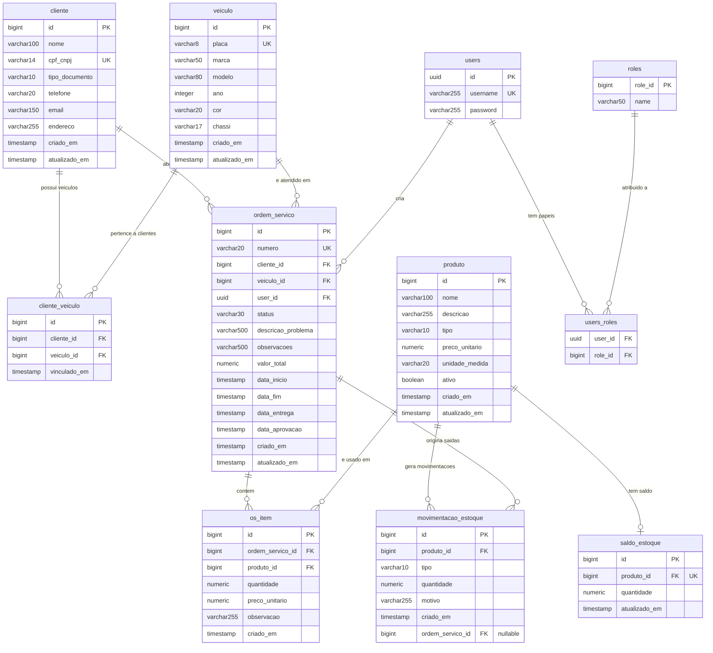

---
Arquivo gerado para visualização em ferramentas que suportam Mermaid ERD.
Ferramentas compatíveis:
  - https://mermaid.live  (online, gratuito)
  - dbdiagram.io          (import via Mermaid ou DBML)
  - Notion / GitHub       (renderiza nativamente em blocos de código mermaid)
  - VS Code               (extensão "Markdown Preview Mermaid Support")
  - Draw.io               (via plugin Mermaid)
---

