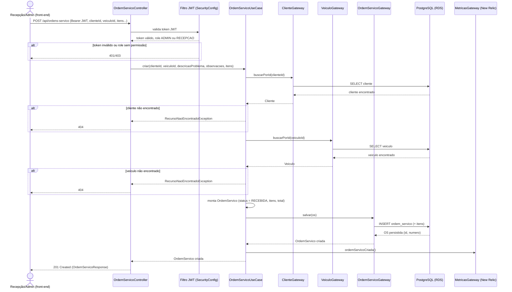

# Diagrama de Sequência — Abertura de Ordem de Serviço

> Cobre só o fluxo de **criação** da OS (`POST /api/ordens-servico`), conforme pedido em
> `docs/requisitos-fase3.md` ("fluxo de... abertura de ordens de serviço"). O ciclo
> completo de status da OS (RECEBIDA → ... → ENTREGUE) já está documentado em texto no
> `README.md`, seção "Fluxo de status da OS".
>
> O diagrama de sequência da **autenticação** (CPF → API Gateway → Lambda → JWT → API)
> fica para quando o RFC da estratégia de autenticação — hoje bloqueado — for fechado (ver
> `CHECKLIST.md`, Seção 1).

## Notas sobre o fluxo real

- Role exigida: `ADMIN` ou `RECEPCAO` (`@PreAuthorize("hasAnyRole('ADMIN', 'RECEPCAO')")`
  em `OrdemServicoController.criar`).
- A OS nasce sempre com status `RECEBIDA` — a transição para os demais status
  (`EM_DIAGNOSTICO`, `AGUARDANDO_APROVACAO`, ...) acontece em chamadas separadas, fora do
  escopo deste diagrama.
- `MetricasGateway.ordemServicoCriada()` é o ponto de instrumentação usado pelo dashboard
  de "Volume diário de ordens de serviço" no New Relic (ver Seção 3 do
  `CHECKLIST.md`).
- Se `clienteId` ou `veiculoId` não existirem, o use case lança
  `RecursoNaoEncontradoException`, traduzida pelo `GlobalExceptionHandler` em `404` — não
  chega a persistir nada.
