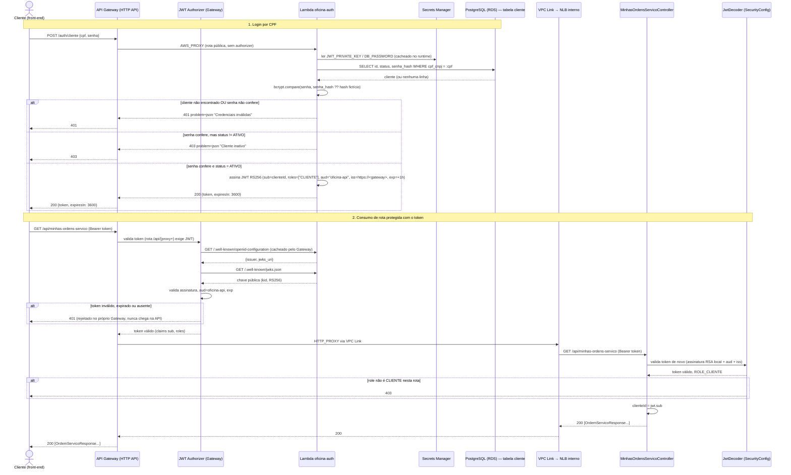

# Diagrama de Sequência — Autenticação (CPF → API Gateway → Lambda → JWT → API)

> Cobre o login do **cliente** por CPF (`POST /auth/cliente`) e o uso do token emitido para
> chamar uma rota protegida da API (`GET /api/minhas-ordens-servico`), conforme pedido em
> `docs/requisitos-fase3.md` ("fluxo de autenticação"). O login de **funcionário**
> (`POST /auth/funcionario`, e-mail + senha) e o **primeiro acesso** do cliente
> (`POST /auth/cliente/primeiro-acesso`) passam pelo mesmo desenho até a Lambda; as
> diferenças estão nas notas abaixo. Decisão documentada em
> [RFC-0003](rfc/0003-estrategia-de-autenticacao-cpf-via-lambda.md).

## Notas sobre o fluxo real

- **Login de funcionário** (`POST /auth/funcionario`) segue a mesma forma, mas troca a
  tabela `cliente` pelo join `users`/`users_roles`/`roles`, o token dura 8h (28800s) em vez
  de 1h, `roles` vem do banco em vez de ser fixo `["CLIENTE"]`, e `sub` é o `username`
  (e-mail) em vez do id. Rotas de funcionário (`/api/**` fora de
  `/api/minhas-ordens-servico`) exigem `ADMIN`, `RECEPCAO` ou `OPERADOR`.
- **Primeiro acesso** (`POST /auth/cliente/primeiro-acesso`) troca o `SELECT` + `bcrypt.compare`
  por um único `UPDATE cliente SET senha_hash = :hash WHERE status = 'ATIVO' AND email =
  :email AND senha_hash IS NULL RETURNING id` — atômico, então só pode ser executado uma
  vez por cliente; uma segunda tentativa (ou CPF/e-mail que não batem) devolve `422`. Em
  caso de sucesso, devolve `201` e já emite o token (mesmo formato do login).
- O token é validado **duas vezes por caminhos independentes**: o authorizer do API Gateway
  usa o JWKS que a própria Lambda publica; a API usa a chave pública fixa injetada via
  Secrets Manager. Um token forjado ou expirado é rejeitado já no Gateway, sem nunca chegar
  à API.
- `cliente` inexistente e senha errada devolvem a **mesma resposta 401** — e a checagem de
  senha roda contra um hash fictício de custo idêntico quando o cliente não existe
  (`bcrypt` de tempo constante), para não vazar, por tempo de resposta, se um CPF está
  cadastrado. O status `INATIVO` só é revelado depois que a senha confere.
- O `iss` do token nunca é fixo em código: a Lambda o deriva do domínio da própria
  requisição (`https://${event.requestContext.domainName}`), e a API espera esse mesmo
  valor via `JWT_ISSUER`/`APP_PUBLIC_BASE_URL` — ver [RFC-0003](rfc/0003-estrategia-de-autenticacao-cpf-via-lambda.md).
